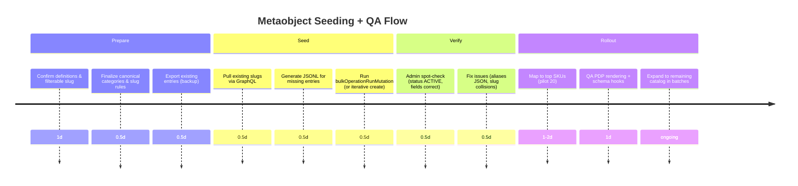

# Production-Ready Seed Dataset for Shopify Metaobjects

## Executive summary

This report compiles a **production-ready, research-backed seed dataset** for three Shopify metaobjects—`ornament_type`, `deity`, and `set_component`—optimized for Indian classical/temple jewellery and deity alankaram catalogs. It normalizes:

- **Canonical slugs** (stable, SEO-safe, filter-ready) aligned to Shopify querying and admin UX patterns. citeturn10view0turn10view1  
- **Regional variants and synonyms** drawn from competitor catalogs that explicitly use South Indian nomenclature (e.g., *Oddiyanam/Vaddanam*, *Nethi Chutti*, *Mattal/Matil*, *Rakodi/Jada Billa*). citeturn8search3turn4search2turn4search3turn6search0turn6search9  
- **Traditions/denominations** and deity alias sets anchored in authoritative references such as entity["organization","Encyclopaedia Britannica","encyclopedia publisher"] and official temple sources. citeturn2search1turn3search0turn26view0turn12search3  
- **Typical size/weight ranges** using published competitor specs (grams + centimeters/inches) for key components (oddiyanam, vanki, rakodi, mattal, jhumka, tikka/nethi-chutti, anklet, and full dance sets). citeturn4search5turn5search4turn7search1turn7search5turn5search0turn22search4turn27search0turn22search11  

Additionally, it provides **Shopify Admin GraphQL templates** for idempotent seeding with **duplicate-check by slug** (leveraging Shopify’s `fields.{key}:{value}` query syntax) and an operational **seeding + QA timeline**. citeturn10view0turn17view2turn20view0turn0search2turn0search18  

## Sources and normalization rules

The dataset is grounded in three source classes:

Competitor catalogs and product pages:
- Classical dance “full set” composition and terminology (Headset/Thalaisaman, Rakodi, Surya/Chandra, Nethi Chutti, Mattal, Oddiyanam, Vanki, Nath, Bullak). citeturn8search3  
- South Indian temple jewellery category naming and regional spellings (*Vaddanam*, *Nethi Chutti Designs (ನೆತ್ತಿಚುಟ್ಟಿ)*, *Matil/Matils*, etc.). citeturn1search3turn1search10turn4search3turn6search2  
- Measured weights/dimensions from published specs (critical for realistic defaults). citeturn4search5turn4search12turn5search4turn7search5turn7search1turn22search4turn27search0turn23search3  

Cultural / religious references:
- Denominational framing (Vaishnavism/Shaivism/Shaktism). citeturn2search1turn3search0  
- Deity identities + alternative names (Britannica’s curated list of Hindu deities is especially useful for alias seeding at scale). citeturn26view0  
- Museum-level object reference for *Jadanagam* as a plait ornament (~60 cm historical exemplar). citeturn8search0  
- Official temple authority for Venkateswara naming (Srinivasa/Balaji/Venkatachalapati). citeturn12search3  

Shopify best practices and API requirements:
- Metaobjects are structured data definitions + entries, referenceable by metafields. citeturn19search15turn16search9turn16search5  
- Query-by-field pattern: `query: "fields.slug:\"value\""` (requires that field be filterable). citeturn10view0turn10view1  
- Publishable capability means entries must be **ACTIVE** to be accessible in Liquid / storefront contexts. citeturn17view3turn0search0turn16search20  
- `metaobjectCreate` supports capability status via `capabilities.publishable.status`. citeturn17view0turn20view0turn17view2  
- Bulk import via `bulkOperationRunMutation` with staged JSONL. citeturn0search2turn0search18  

### Normalization rules used in the seed list

Slugs (canonical identifiers):
- Lowercase ASCII, hyphen-separated: `oddiyanam-waist-belt`, `nethi-chutti`, `venkateswara`.  
- Keep slugs **semantic but stable**: avoid years, campaign terms, or materials.  
- Prefer one canonical spelling, store variants as aliases (e.g., `oddiyanam` canonical; `ottiyanam`, `vaddanam` aliases). citeturn4search2turn9search13turn8search3  

Categories:
- Use **body-placement taxonomy** for ornament/component categorization: `headwear`, `hairwear`, `neckwear`, `earwear`, `nosewear`, `armwear`, `waistwear`, `footwear`, `set`, `deity-accessory`.  
- For deities, use functional catalog categories: `devi`, `vishnu-avatar`, `shaiva-deity`, `regional-form`, `auxiliary`. (Tradition is separately tracked.)

Weights and sizes:
- When competitor pages publish weights/lengths, the range uses those values as anchors. For example:  
  - Oddiyanam: published from ~53 g to ~296 g in fashion/temple variants, and ~114 cm lengths for larger belts. citeturn4search1turn4search14turn4search5  
  - Rakodi: ~23–54 g and ~5.5–10 cm on product specs; another vendor gives ~3 inch diameter guidance. citeturn7search3turn7search13turn6search9  
  - Nethi chutti (tikka): ~6–19 g and ~7–13 cm in published specs. citeturn22search4turn22search6  

image_group{"layout":"carousel","aspect_ratio":"1:1","query":["Bharatanatyam temple jewellery set nethi chutti rakodi vanki oddiyanam","Oddiyanam vaddanam waist belt temple jewellery","Rakodi jada billa bun cover Bharatanatyam jewellery","Jadanagam braid ornament South Indian bride"],"num_per_query":1}

## Seed dataset tables

### Metaobject `ornament_type` seed table

> Intended use: a reusable “product type/entity class” vocabulary for product identity, filters, schema mapping, and internal catalog governance.

| Display name | Slug | Category | Aliases (array) | Suggested default fields/values (JSON) | Example product mappings | Localization notes |
|---|---:|---|---|---|---|---|
| Bharatanatyam Full Set (Temple Jewellery) | bharatanatyam-full-set | set | ["classical dance full set","temple jewellery full set","arangetram set"] | {"typical_weight_grams_range":[450,750],"audience":["adult","kids"],"contains_components_hint":["thalaisaman","nethi-chutti","mattal","oddiyanam","vanki"]} | Full dance set listings; stage jewellery kits | Commonly sold in “adult” and “kids” variants. citeturn8search3turn22search11turn5search8 |
| Headset (Thalaisaman) | thalaisaman-headset | headwear | ["head set","thalaisaman","head ornament set"] | {"contains":["rakodi","surya","chandra"],"typical_use":["bharatanatyam","kuchipudi"]} | Headset bundles (rakodi + sun/moon) | Tamil term “Thalaisaman” often used in dance context. citeturn8search3 |
| Rakodi (Bun Cover) | rakodi | hairwear | ["jada billa","billai","bun cover"] | {"typical_weight_grams_range":[23,55],"typical_size_note":"~3 inch diameter; height 5.5–10 cm"} | Rakodi / Jada Billa items | Also called “Billai”; used for Bharatanatyam/Kuchipudi bun. citeturn6search9turn7search13turn7search3 |
| Surya–Chandra Head Ornaments | surya-chandra | headwear | ["surian","chandran","sun moon ornament"] | {"typical_weight_grams_range":[10,40],"pairing":"often used with thalaisaman"} | “Surya Chandra” hair jewel SKUs | Spellings vary: Surian/Surya; Chandran/Chandra. citeturn8search3turn9search8 |
| Nethi Chutti (Forehead Ornament) | nethi-chutti | headwear | ["maang tikka","tikka","nethichutti"] | {"typical_weight_grams_range":[6,20],"typical_length_cm_range":[7,13]} | Forehead tikka products; dance headpieces | Kushals uses “Nethi Chutti Designs (ನೆತ್ತಿಚುಟ್ಟಿ)” showing localization in Kannada script. citeturn1search10turn22search4turn22search6 |
| Mattal (Ear Chain) | mattal | earwear | ["matil","mattel","ear chain"] | {"typical_weight_grams_range":[8,40],"typical_length_cm_range":[13,15],"is_pair":true} | Mattal / Matil products; “jhumka with mattal” | Competitor categorizes explicitly as “Mattal \| Matil \| Mattel.” citeturn4search3turn7search5turn7search24 |
| Jhumka Earrings | jhumka | earwear | ["jhumkas","bell earrings"] | {"typical_weight_grams_range":[6,36],"typical_length_cm_range":[3,5],"is_pair":true} | Temple jhumkas; jhumka + mattal | Competitor pages publish weights and lengths (e.g., 6–15 g; ~3–4 cm). citeturn5search0turn5search21turn5search13 |
| Choker / Padakkam (Short Necklace) | choker-padakkam | neckwear | ["padakkam","short necklace","dance choker"] | {"typical_weight_grams_range":[60,110],"layer":"short"} | Short necklace in dance sets | Dance set guides use “Choker or Padakkam.” citeturn8search3turn7search6 |
| Long Haram | long-haram | neckwear | ["haram","long necklace","pearl haram"] | {"typical_weight_grams_range":[130,180],"layer":"long"} | Long chain in dance sets | Full set breakdowns list haram weights around 133–171 g. citeturn7search9turn22search9turn7search6 |
| Mango Malai | mango-malai | neckwear | ["manga malai","mango necklace"] | {"motif":"mango","common_in":"classical sets"} | Mango motif long chains | Shanthi Tailors lists “Manga Malai” as the long chain option. citeturn8search3 |
| Vanki (Armlet / Bajuband) | vanki | armwear | ["bajuband","armlet","armband"] | {"typical_weight_grams_range":[35,55],"size_note":"~10.5–11.9 cm per armlet"} | Upper arm ornaments; dance set armlets | Explicit “Vanki or Bajuband” naming is common. citeturn4search15turn5search22turn5search4 |
| Oddiyanam (Waist Belt) | oddiyanam | waistwear | ["ottiyanam","vaddanam","kamarband","kati sutra"] | {"typical_weight_grams_range":[50,300],"typical_length_cm_range":[90,115],"kids_variant_possible":true} | Bridal hip belts; dance waist belts; deity belts | Competitors use Oddiyanam/Vaddanam interchangeably; deity belt listings include “Kati Sutra” too. citeturn4search2turn9search13turn4search5turn4search10 |
| Nose Ring (Nath) | nath | nosewear | ["nose ring","naath"] | {"typical_weight_grams_range":[2,15]} | Bridal nose ring; dance accessories | Dance set guides mention “Nath” as part of classical kit. citeturn8search3 |
| Bullak / Bullakku (Septum Ornament) | bullakku | nosewear | ["bullak","septum ornament"] | {"typical_weight_grams_range":[2,10]} | Classical dance nose set | Classical dance guides list “Bullak/Bullakku” alongside nath. citeturn8search3turn9search4 |
| Anklet / Kolusu / Payal | anklet-kolusu-payal | footwear | ["kolusu","payal","anklets"] | {"typical_weight_grams_range":[2,50],"typical_length_cm_range":[20,28]} | Temple anklets; silver payal; dance anklets | Competitor uses “Payal” with published weight/length; other listings use “Anklet.” citeturn27search1turn27search0turn27search4 |

### Metaobject `deity` seed table

> Intended use: a canonical deity vocabulary for “deity motif” products, alankaram compatibility content, SEO entity consistency, and filtering.

| Display name | Slug | Category | Aliases (array) | Suggested default fields/values (JSON) | Example product mappings | Localization notes |
|---|---:|---|---|---|---|---|
| Lakshmi | lakshmi | devi | ["Shri","Padma","Kamala","Varalakshmi"] | {"tradition":"vaishnavism (consort)","domains":["wealth","fortune","abundance"]} | Lakshmi motif oddiyanam/vaddanam; Varalakshmi vratam jewellery | Britannica lists Lakshmi aliases and Vishnu-consort framing. citeturn26view0turn14view1 |
| Durga | durga | devi | ["Devi","Shakti"] | {"tradition":"shaktism (primary)","domains":["protection","power"]} | Durga motif pendants/temple sets | Durga is a principal form of the supreme Goddess (Devi/Shakti). citeturn13view3turn3search0 |
| Saraswati | saraswati | devi | ["Vagdevi","Bharati","Brahmi","Shweta"] | {"tradition":"pan-hindu (widely revered)","domains":["learning","arts","music"]} | Saraswati motif pendants; Vasant Panchami gifting | Britannica list provides Saraswati’s alternate names. citeturn26view0turn3search1 |
| Vishnu | vishnu | shaiva-deity | ["Vasudeva","Narayana","Hari"] | {"tradition":"vaishnavism","domains":["preservation","dharma"]} | Vishnu/Perumal ornamentation sets | Vishnu’s common names are listed explicitly in Britannica. citeturn26view0turn14view0 |
| Krishna | krishna | vishnu-avatar | ["Govinda","Gopala","Madhava","Shyam"] | {"tradition":"vaishnavism (krishna bhakti)","domains":["devotion","love","protection"]} | Krishna motif pendants; Janmashtami edits | Britannica list provides key Krishna aliases. citeturn26view0turn11search1 |
| Rama | rama | vishnu-avatar | ["Ramachandra","Raghu","Raghavan"] | {"tradition":"vaishnavism (rama bhakti)","domains":["virtue","kingship"]} | Rama-centric pendants/lockets | Britannica list includes multiple Rama aliases. citeturn26view0turn13view1 |
| Hanuman | hanuman | auxiliary | ["Anjaneya","Bajrangbali","Maruti"] | {"tradition":"vaishnavism (rama devotion)","domains":["strength","devotion"]} | Hanuman lockets; spiritual gifting | Britannica list provides Hanuman’s alternate names. citeturn26view0turn14view3 |
| Shiva | shiva | shaiva-deity | ["Shambu","Shankara","Hara","Mahesha","Nilakantha"] | {"tradition":"shaivism","domains":["asceticism","transformation"]} | Shiva/lingam motif items | Britannica list provides Shiva’s alternate names and Shaiva framing. citeturn26view0turn11search10 |
| Ganesha | ganesha | auxiliary | ["Ganapati","Vinayaka","Vigneshvara"] | {"tradition":"pan-hindu","domains":["beginnings","obstacle-removal"]} | Ganesha pendants; “new venture” gifting | Ganesha is worshipped before major enterprise; alternate names listed. citeturn13view2turn26view0 |
| Venkateswara | venkateswara | vishnu-avatar | ["Srinivasa","Balaji","Venkatachalapati"] | {"tradition":"srivaishnavism","domains":["boons","forgiveness"]} | Tirupati-style deity ornamentation; alankaram sets | Official temple history page and Britannica confirm Srinivasa/Balaji naming. citeturn12search3turn26view0turn2search3 |
| Murugan | murugan | regional-form | ["Skanda","Kartikeya","Kumara","Subrahmanya"] | {"tradition":"shaiva (south indian)","domains":["warrior","valor"]} | Murugan motif items | Murugan is later associated with Skanda; Skanda aliases listed in Britannica. citeturn14view2turn24view0turn26view0 |
| Ayyappan | ayyappan | regional-form | ["Śāsta","Sartavu","Ayyappa"] | {"tradition":"syncretic (kerala)","domains":["discipline","pilgrimage"]} | Ayyappa devotional items | Britannica provides alternate names and Kerala shrine prominence. citeturn24view1 |
| Parvati | parvati | devi | ["Uma","Gauri","Aparna","Meenakshi"] | {"tradition":"shaiva (consort) / pan-hindu","domains":["fertility","household"]} | Goddess motif temple jewellery | Britannica list provides Parvati alternate names. citeturn26view0 |
| Radha | radha | auxiliary | ["Radharani"] | {"tradition":"vaishnavism (krishna bhakti)","domains":["devotion","love"]} | Radha-Krishna motif pieces | Lakshmi article frames Radha as Krishna’s beloved within Vishnu-consort incarnations. citeturn14view1turn13view0 |
| Skanda | skanda | shaiva-deity | ["Kartikeya","Kumāra","Subrahmanya","Shanmukha"] | {"tradition":"shaivism","domains":["war","leadership"]} | Skanda/Subrahmanya motif jewellery | Britannica’s Skanda article lists alternate names and South India Subrahmanya usage. citeturn24view0turn26view0 |

### Metaobject `set_component` seed table

> Intended use: a controlled “set includes” vocabulary for product bundles and structured PDP rendering. It aligns closely with standard classical set composition. citeturn8search3

| Display name | Slug | Category | Aliases (array) | Suggested default fields/values (JSON) | Example product mappings | Localization notes |
|---|---:|---|---|---|---|---|
| Choker / Padakkam | choker-padakkam | neckwear | ["short necklace","padakkam"] | {"quantity":1,"is_pair":false,"size_note":"short layer; commonly paired with long haram","typical_weight_grams_range":[60,110]} | Bharatanatyam/kuchipudi set | “Padakkam” used in dance set descriptions. citeturn8search3turn7search6 |
| Long Haram | long-haram | neckwear | ["haram","long chain"] | {"quantity":1,"is_pair":false,"size_note":"long layer","typical_weight_grams_range":[130,180]} | Full sets; bridal temple harams | Published haram weights in sets ~133–171 g. citeturn7search9turn22search9 |
| Mango Malai | mango-malai | neckwear | ["manga malai","mango necklace"] | {"quantity":1,"is_pair":false,"size_note":"mango motif long chain","typical_weight_grams_range":[120,200]} | Classical long chain option | Appears as canonical long chain option in set guides. citeturn8search3 |
| Nethi Chutti / Tikka | nethi-chutti | headwear | ["maang tikka","tikka"] | {"quantity":1,"is_pair":false,"size_note":"forehead ornament; 7–13 cm typical","typical_weight_grams_range":[6,20]} | Head jewels; dance sets | Tikka weights/lengths are explicitly published on competitor product pages. citeturn22search4turn22search6 |
| Surya Ornament | surya | headwear | ["surian","sun ornament"] | {"quantity":1,"is_pair":false,"size_note":"worn on one side of headpiece"} | Headset / thalaisaman | Part of Thalaisaman headset: Surian + Chandran. citeturn8search3 |
| Chandra Ornament | chandra | headwear | ["chandran","moon ornament"] | {"quantity":1,"is_pair":false,"size_note":"worn on one side of headpiece"} | Headset / thalaisaman | Part of Thalaisaman headset: Surian + Chandran. citeturn8search3 |
| Rakodi (Bun Cover) | rakodi | hairwear | ["bun cover","billai","jada billa"] | {"quantity":1,"is_pair":false,"size_note":"~3 inch diameter; covers bun","typical_weight_grams_range":[23,55]} | Bun cover for stage hair | Vendor notes: placed on bun; also called “Billai”; ~3 inch diameter. citeturn6search9turn7search13turn7search3 |
| Jada Billa / Jada Billai (Braid/Hair Jewel) | jada-billa | hairwear | ["jada billai","choti ornament"] | {"quantity":1,"is_pair":false,"size_note":"varies by piece-count; can be long (e.g., ~32 cm)","typical_weight_grams_range":[40,160]} | Bridal hair accessories; dance braid jewels | Competitor pages publish weights up to ~163 g for multi-piece jada billa. citeturn7search22turn8search1turn21search0 |
| Mattal (Ear Chain) | mattal | earwear | ["matil","mattel","ear chain"] | {"quantity":1,"is_pair":true,"size_note":"13–15 cm typical; hooks to hair","typical_weight_grams_range":[8,40]} | “jhumka & mattal” sets | Published: 13 cm/40 g; 15 cm/31 g examples. citeturn7search5turn7search24turn4search3 |
| Jhumka Earrings | jhumka | earwear | ["jhumkas","bell earrings"] | {"quantity":1,"is_pair":true,"size_note":"~3–5 cm common","typical_weight_grams_range":[6,36]} | Temple earrings; stage kits | Published weights/lengths on competitor product pages. citeturn5search0turn5search21turn5search13 |
| Vanki (Armlet) | vanki | armwear | ["bajuband","armlet"] | {"quantity":2,"is_pair":true,"size_note":"~10.5–11.9 cm each; adjustable","typical_weight_grams_range":[70,110]} | Dance sets; bridal armlets | Single armlet weights ~36–49 g are published (pair commonly 70–110 g). citeturn5search22turn5search4 |
| Oddiyanam (Waist Belt) | oddiyanam | waistwear | ["ottiyanam","vaddanam","kamarband","kati sutra"] | {"quantity":1,"is_pair":false,"size_note":"adjustable; 90–115 cm adult; smaller kids variants exist","typical_weight_grams_range":[50,300]} | Bridal hip belts; stage belts; deity belts | Published specs include 114 cm / 288–296 g models; smaller 20 g kids versions. citeturn4search5turn4search14turn4search10turn9search13 |
| Nath (Nose Ring) | nath | nosewear | ["nose ring","naath"] | {"quantity":1,"is_pair":false,"size_note":"classical kit item","typical_weight_grams_range":[2,15]} | Classical dance nose ornaments | Listed in “full set” composition guides. citeturn8search3 |
| Bullakku (Septum Ornament) | bullakku | nosewear | ["bullak","septum ornament"] | {"quantity":1,"is_pair":false,"size_note":"worn between nostrils","typical_weight_grams_range":[2,10]} | Classical dance nose set | Listed with nath in set composition references. citeturn8search3turn9search4 |
| Anklet / Kolusu / Payal | anklet | footwear | ["kolusu","payal"] | {"quantity":1,"is_pair":true,"size_note":"~20–28 cm typical depending on style","typical_weight_grams_range":[2,50]} | Temple anklets; silver payal | Published examples range from 2 g lightweight payal to 45 g anklets at 26.5 cm. citeturn27search1turn27search0 |

## GraphQL bulk creation templates and validation rules

### Validation rules recommended for production seeding

These rules are framed to support: (a) Shopify admin usability, (b) reliable querying, and (c) idempotent imports.

Slug rules:
- `slug` must be **unique per metaobject type** and marked as **filterable** so `metaobjects(... query: "fields.slug:\"...\"")` works. citeturn10view1turn10view0  
- Pattern: `^[a-z0-9]+(?:-[a-z0-9]+)*$` (no spaces, no underscores; keep it URL-safe).  
- Recommended max length: 64–80 chars (to prevent UI truncation and accidental near-duplicates).

Status rules:
- If publishable capability is enabled, set `capabilities.publishable.status: ACTIVE` at creation (or immediately after), because draft entries won’t resolve in Liquid. citeturn17view3turn20view0turn17view2  

Array/list rules:
- GraphQL `MetaobjectFieldInput.value` is a **String** even for non-text fields. citeturn29search0  
- For list-like fields (e.g., aliases if configured as a list), pass JSON-encoded arrays in the `value` string (e.g., `"[\"alias1\",\"alias2\"]"`). Shopify community guidance for list types consistently uses JSON-encoded arrays. citeturn29search13turn29search0  

Set component rules:
- `quantity`: integer ≥ 1  
- `is_pair`: boolean  
- `size_note`: keep short (≤ 120 chars) and consistent (“cm/inches”, “adjustable”, and placement guidance).

### Duplicate-check by slug using Shopify query syntax

Shopify’s recommended field-query syntax is:

`metaobjects(type: "your_type", query: "fields.slug:\"value\"")` citeturn10view0turn10view1  

This enables a robust “check then create” workflow.

#### GraphQL query template: find existing by slug

```graphql
query FindBySlug($type: String!, $slug: String!) {
  metaobjects(
    first: 1
    type: $type
    query: "fields.slug:\"%s\""
  ) {
    nodes {
      id
      handle
      displayName
      slug: field(key: "slug") { value }
    }
  }
}
```

Implementation note: Most Admin API clients will format the `query` string at runtime (replace `%s` with `$slug`) because GraphQL doesn’t interpolate inside string literals.

#### GraphQL mutation template: create metaobject entry with ACTIVE status

```graphql
mutation CreateMetaobject($metaobject: MetaobjectCreateInput!) {
  metaobjectCreate(metaobject: $metaobject) {
    metaobject {
      id
      handle
      displayName
      capabilities {
        publishable { status }
      }
    }
    userErrors { field message code }
  }
}
```

Variables example (for `ornament_type`):

```json
{
  "metaobject": {
    "type": "ornament_type",
    "handle": "oddiyanam",
    "capabilities": {
      "publishable": { "status": "ACTIVE" }
    },
    "fields": [
      { "key": "name", "value": "Oddiyanam (Waist Belt)" },
      { "key": "slug", "value": "oddiyanam" },
      { "key": "category", "value": "waistwear" }
    ]
  }
}
```

This uses:
- `MetaobjectCreateInput.capabilities` citeturn17view0turn17view1  
- `MetaobjectCapabilityDataPublishableInput.status` citeturn20view0turn17view2  

#### Bulk creation template: `bulkOperationRunMutation` (JSONL import)

Shopify bulk imports execute a mutation repeatedly from a staged JSONL upload. citeturn0search2turn0search18  

Mutation body for bulk execution (example for `ornament_type`):

```graphql
mutation BulkCreateOrnamentType($input: MetaobjectCreateInput!) {
  metaobjectCreate(metaobject: $input) {
    metaobject { id handle }
    userErrors { field message code }
  }
}
```

JSONL line example (one per entry):

```json
{"input":{"type":"ornament_type","handle":"rakodi","capabilities":{"publishable":{"status":"ACTIVE"}},"fields":[{"key":"name","value":"Rakodi (Bun Cover)"},{"key":"slug","value":"rakodi"},{"key":"category","value":"hairwear"}]}}
```

**How to do duplicate-check with bulk operations (production-safe)**  
Bulk operations themselves don’t conditionally skip creates. The recommended approach is:

1) Query existing slugs first (per type) with `metaobjects(type:, first:, query:)` and build a `Set(slug)` locally. citeturn10view1turn10view0  
2) Generate JSONL only for missing slugs.  
3) Upload + run `bulkOperationRunMutation`. citeturn0search2turn0search18  

### Admin UI verification points

In Shopify admin, use the following checks:

- Confirm entries exist: **Content → Metaobjects → (definition)**. citeturn16search10  
- Confirm status is Active if needed: entry editor status dropdown. citeturn16search10turn17view3  
- Confirm “slug” field is filterable (so `fields.slug:"..."` queries work). citeturn10view1  

### Reference image links useful for merch QA

(As requested: direct URLs are provided in a code block.)

```text
Jadanagam (plait ornament) museum reference (dimensions, images)
https://www.metmuseum.org/art/collection/search/453427

Classical set composition glossary-style breakdown (Thalaisaman, Rakodi, Surya/Chandra, etc.)
https://shanthitailor.com/collections/bharatanatyam-jewellery-full-set

Rakodi placement + diameter reference
https://www.dancecostumesandjewelry.com/rakodi-imitation-bharatanatyam-jewelry-itj75dx/

Deity crown sizing/weight example (Kireedam / Mukut)
https://giri.in/products/kireedam-9-5-x-8-5-inches-velcro-type-mukut
```

## Migration and QA checklist

Below is a production checklist designed to avoid duplicate taxonomy drift and to ensure Shopify querying + onsite rendering remains stable.

Pre-seeding preparation:
- Confirm all three metaobject definitions exist and that `slug` fields are **filterable** (required for `fields.slug:"..."` duplicate-check queries). citeturn10view1turn10view0  
- Confirm publishable capability settings (if enabled, plan to seed entries as **ACTIVE**). citeturn19search4turn17view3turn20view0  
- Export/backup current metaobject entries (GraphQL query dump is sufficient).
- Lock canonical category vocabulary (body-placement taxonomy) to prevent drift.

Seeding execution QA:
- Seed in this order: `ornament_type` → `deity` → `set_component` (because products often reference types and deities before set composition is finalized).
- Run idempotent seeding (skip existing slugs, create only missing).
- Verify sample entries in admin:
  - 3 entries per type
  - check slug correctness, alias JSON formatting, and status active. citeturn16search10turn17view3  

Post-seeding merch QA:
- Pick 5 representative products (dance set, oddiyanam, vanki, nethi-chutti, deity crown). Confirm:
  - correct metaobject selections in product metafields (if already wired)
  - PDP renders expected label text (if theme already reads metaobjects)
  - search/filter rules behave (if Search & Discovery filters rely on these values).

Ongoing governance:
- Add one internal rule: “New entries must include at least 2 alias variants (regional spelling + English/common).”
- Review quarterly for taxonomy expansion (e.g., add `salangai/ghungroo`, `toe-ring/metti`, `jadanagam` variants) as catalog grows.

### Mermaid timeline for seeding + QA flow



